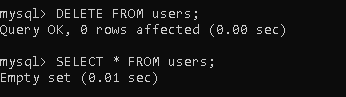

# Configuración de MySQL

## Ejecución de los contenedores 

## Acceso a la terminal

## Actualización de contraseña root

## Lista de bases de datos

## Lista de tablas en la base de datos

## Verificando usuarios y privilegios

## Accediendo a la base de datos con el nuevo usuario y verificando los usuarios existentes

## CRUDL Usuarios

## Verificando permisos

# Vulnerabilidades OWASP

Desde la perspectiva objetiva, basandome por ejemplo en el OWASP 2017, esta configuración de base de datos y de usuario se relacionan con los siguientes puntos:

1. A06: Configuración de seguridad incorrecta -> Realizamos una configuración un tanto "segura" al restringir el acceso del usuario root unicamente por el localhost y cambiando la contraseña por defecto.

2. A05: Pérdida de Control de Acceso -> Las acciones que realiza el usuario sobre la base de datos se encuentran limitadas.

Ahora bien, desde la perspectiva subjetiva, identificar las acciones realizadas dentro de una sola sección del OWASP es complicado. Si bien, las descripciones son claras y tienen soluciones concisas pero, por ejemplo, para el caso de la configuración de las acciones que puede realizar el usuario creado, podriamos decir que se ve directamente implicada la A05 pero también estariamos, para este caso, blindando nuestro sistema contra una posible inyección SQL (A01), limitando las acciones que puede realizar un atacante si roba un toke de autenticación (A02), o evitar (no es el caso porque el usuario puede consultar) que se consulten datos sensibles de una base de datos (A03).